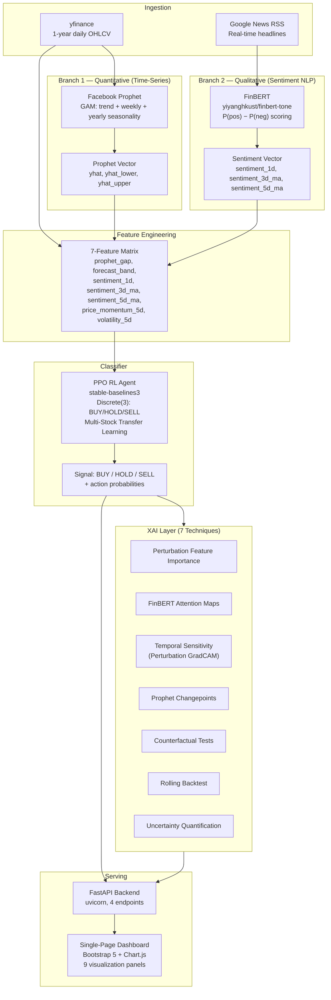

# AlphaGaze — Agent Context

> **Explainable AI Stock Market Predictor for Indian Equities**
> Dual-branch ML pipeline (Prophet + FinBERT) → Random Forest classifier → 7 XAI layers → Interactive Dashboard

---

## 1. Architecture Overview



---

## 2. Module Reference

### `app/predictor.py` (749 lines) — Main Pipeline Orchestrator

The central module. Runs the full end-to-end pipeline for any supported stock and returns a rich prediction dict. Results are cached in-memory for 1 hour.

**Key functions:**

| Function | Purpose |
|----------|---------|
| `predict(symbol: str) → dict` | Full pipeline entry point. Fetches prices, fits Prophet, scrapes news, runs FinBERT, trains RF, generates all XAI data. Returns the prediction result dict. Cached for `CACHE_TTL` seconds. |
| `_load_finbert()` | Lazy-loads the FinBERT model and tokenizer (shared global singletons). Uses `yiyanghkust/finbert-tone` with `attn_implementation="eager"` for attention output support. |
| `_score_headlines(headlines, batch_size=32) → list[float]` | Batch FinBERT inference. Returns `P(positive) − P(negative)` per headline. |
| `_get_attention_maps(headlines, max_headlines=5) → list[dict]` | Extracts last-layer CLS→token attention from FinBERT. Merges `##` subword tokens (keeps max attention). Filters noise/punctuation tokens. Min-max normalizes to [0,1]. Returns `{headline, tokens, attention, sentiment, token_count, unk_ratio}`. |
| `_aggregate_attention_keywords(attention_maps, top_k=12) → list[dict]` | Cross-headline keyword summary ranked by average attention. Returns `{token, avg_attention, mentions}`. |
| `_prophet_sensitivity(prices_df, prophet_model, forecast_df, n_segments=10) → dict` | Perturbation-based temporal sensitivity. Divides history into N windows, injects 10% noise per segment, re-fits Prophet, measures forecast deviation. Also extracts changepoints and builds full forecast chart data. |
| `_compute_uncertainty_summary(proba, latest_row, sentiment_score) → dict` | Multi-signal uncertainty: `0.45×entropy_norm + 0.25×margin_uncertainty + 0.20×forecast_uncertainty + 0.10×sentiment_uncertainty`. Maps to actionability: TRADE / CAUTION / NO_TRADE. |
| `_counterfactual_headline_tests(attention_maps, max_items=3) → list[dict]` | Removes the highest-attention token from headlines, re-scores sentiment, reports delta and polarity flips. |
| `_rolling_backtest(merged_df, n_points=90, min_train=40) → dict` | Walk-forward backtest: trains RF on data up to each date, predicts next day. Reports accuracy, avg confidence, and confidence-bucket hit rates. |
| `_build_features(df) → pd.DataFrame` | Engineers the 7 feature columns from merged price+forecast+sentiment data. |
| `_label(ret: float) → str` | Maps next-day return to BUY/HOLD/SELL using thresholds. |
| `_is_noise_token(token) → bool` | Filters `[CLS]`, `[SEP]`, `[PAD]`, `[UNK]`, empty strings, and punctuation-only tokens. |

**Key constants:**
- `CACHE_TTL = 3600` (1 hour)
- `BUY_THRESHOLD = 0.003` (+0.3%)
- `SELL_THRESHOLD = -0.003` (−0.3%)
- `FEATURE_COLS` — the 7 feature column names
- `SUPPORTED_STOCKS` — dict of 10 Indian stocks/indices
- `SPECIAL_TOKENS = {"[CLS]", "[SEP]", "[PAD]", "[UNK]"}`

---

### `app/api.py` (105 lines) — FastAPI Backend

Serves the frontend and exposes the prediction API.

**Endpoints:**

| Method | Path | Handler | Description |
|--------|------|---------|-------------|
| `GET` | `/` | `serve_frontend()` | Serves `frontend/index.html` |
| `GET` | `/api/stocks` | `get_stocks()` | Returns list of `{symbol, name}` for all supported stocks |
| `GET` | `/api/predict/{symbol}` | `get_prediction(symbol)` | Runs full pipeline via `predict()`. 404 if unsupported, 422 if data error, 500 on pipeline failure |
| `GET` | `/api/news/{symbol}` | `get_news(symbol, max_articles=30)` | Scrapes headlines only (no ML), fast endpoint |
| `GET` | `/api/evaluate/{symbol}` | `evaluate_model(symbol)` | Runs offline evaluation via `evaluate_pipeline()` |

**Configuration:**
- CORS: all origins allowed (`*`)
- Static files mounted at `/static` from `app/frontend/`
- Run command: `uvicorn app.api:app --reload --port 8000`

---

### `app/scraper.py` (106 lines) — News Scraper

Fetches real-time financial headlines via Google News RSS. No API key required.

**Key functions:**

| Function | Purpose |
|----------|---------|
| `scrape_news(symbol, max_articles=100) → list[dict]` | Fetches RSS feed for the stock, deduplicates headlines, extracts dates, unwraps Google redirect URLs. Returns `[{title, date, url}]` sorted newest-first. |
| `_clean_title(raw) → str` | Strips HTML tags and unescapes entities. |
| `_extract_date(entry) → str` | Parses RFC 2822 date from RSS entry, falls back to today's date. |

**Symbol → Query mapping** (`STOCK_QUERIES`):
```
^NSEI       → "NIFTY 50 India stock market"
^BSESN      → "Sensex BSE India stock market"
RELIANCE.NS → "Reliance Industries India stock"
TCS.NS      → "TCS Tata Consultancy Services India stock"
HDFCBANK.NS → "HDFC Bank India stock"
INFY.NS     → "Infosys India stock"
ICICIBANK.NS→ "ICICI Bank India stock"
WIPRO.NS    → "Wipro India stock"
SBIN.NS     → "SBI State Bank of India stock"
BHARTIARTL.NS→"Bharti Airtel India stock"
```

RSS URL template: `https://news.google.com/rss/search?q={query}&hl=en-IN&gl=IN&ceid=IN:en`

---

### `app/sentiment.py` (79 lines) — Standalone Batch Sentiment Scorer

Offline batch processing of the IN-FINews dataset through FinBERT.

**Key functions:**

| Function | Purpose |
|----------|---------|
| `get_sentiment_scores_batch(texts, tokenizer, model, batch_size=32) → list[float]` | Batch FinBERT inference. Score = `P(positive) − P(negative)`. |
| `run_sentiment_analysis()` | Loads IN-FINews dataset, runs FinBERT on all headlines, aggregates daily mean sentiment, saves to `results/daily_sentiment.csv`. |

---

### `app/time_series.py` (47 lines) — Standalone Prophet Fitting

Offline Prophet training on NIFTY 50 historical data.

**Key functions:**

| Function | Purpose |
|----------|---------|
| `run_prophet()` | Downloads NIFTY 50 from 2018-01-01 to 2025-09-01, fits Prophet (weekly + yearly seasonality, no daily), forecasts 30 days, saves to `results/prophet_forecast.csv`. |

---

### `app/combine_and_xai.py` (275 lines) — Standalone Merge + SHAP

Offline pipeline that combines pre-computed Prophet forecasts and sentiment scores, trains RF, generates SHAP plots, and outputs a live trade signal.

**Key functions:**

| Function | Purpose |
|----------|---------|
| `build_features(merged) → pd.DataFrame` | Same 7-feature engineering as `predictor.py`. |
| `label_signal(ret) → str` | Same BUY/HOLD/SELL thresholds. |
| `run_combine_and_xai()` | Loads `results/prophet_forecast.csv` and `results/daily_sentiment.csv`, downloads NIFTY prices, merges, trains RF with 5-fold TimeSeriesSplit CV, generates confusion matrix + SHAP summary + beeswarm + dependence plots, outputs live signal. |

**Generated plots:**
- `results/confusion_matrix.png`
- `results/shap_summary_plot.png`
- `results/shap_beeswarm_buy.png`
- `results/shap_dependence_sentiment_buy.png`
- `results/latest_prediction.csv`

---

### `app/evaluator.py` (150 lines) — Evaluation Pipeline

Computes quantitative metrics for the full pipeline.

**Key functions:**

| Function | Purpose |
|----------|---------|
| `evaluate_pipeline(symbol) → dict` | Fetches 1-year data, fits Prophet, computes MAE/RMSE, builds mock features, runs 5-fold TimeSeriesSplit RF CV, computes accuracy/precision/recall/F1/confusion matrix. Also checks sentiment agreement rate against IN-FINews using a proxy lexicon. |

**Output schema:**
```python
{
    "classification": {accuracy, precision, recall, f1_score, confusion_matrix, classes},
    "prophet_regression": {mae, rmse},
    "sentiment_agreement": {description, agreement_rate}
}
```

---

### `app/frontend/index.html` (850 lines) — Dashboard

Single-page application with dark GitHub-inspired theme.

**Tech stack:** Bootstrap 5 (CSS), Chart.js 4.4.2 (charts), vanilla JavaScript (no framework).

**9 Visualization Panels:**

| Panel | Data Source | Rendering |
|-------|------------|-----------|
| Trade Signal | `signal` | Large colored badge (green/yellow/red) |
| Uncertainty / Confidence | `uncertainty` | Progress bar + actionability badge (TRADE/CAUTION/NO_TRADE) |
| Market Snapshot | `price`, `prophet_yhat`, `sentiment`, `date` | Stat cards |
| Signal Probabilities | `probabilities` | Horizontal bar chart (Chart.js) |
| Prophet Forecast | `prophet_sensitivity.forecast_chart` | Line chart with confidence band fill (Chart.js) |
| Temporal Sensitivity | `prophet_sensitivity.segments` | Vertical bar chart with red gradient (Chart.js) |
| SHAP Feature Impact | `shap_values` | Horizontal bar chart, blue=positive/red=negative (Chart.js) |
| FinBERT Attention Maps | `attention_maps` + `attention_keywords` | Token heatmap with color gradient (blue→yellow→red), keyword pills |
| Latest News | `news` | Scrollable list with sentiment badges |
| Rolling Backtest | `rolling_backtest` | Metric cards + confidence bucket bars + scrollable results table |
| Counterfactual Tests | `counterfactual_tests` | Cards showing token removal, sentiment delta, polarity flips |
| Changepoints | `prophet_sensitivity.changepoints` | Grid of date cards with magnitude progress bars |

---

## 3. Data Flow — Step by Step

The `predict(symbol)` function in `predictor.py` orchestrates the following pipeline:

### Step 1: Price Ingestion
```
yfinance.download(symbol, period=365 days) → prices DataFrame [ds, y]
```
- Extracts `Date` and `Close` columns
- `current_price` = last close value

### Step 2: Prophet Time-Series Forecasting
```
Prophet(daily=False, weekly=True, yearly=True).fit(prices)
→ make_future_dataframe(periods=30)
→ forecast DataFrame [ds, yhat, yhat_lower, yhat_upper]
```

### Step 3: News Scraping
```
scrape_news(symbol, max_articles=150)
→ Google News RSS → feedparser
→ articles [{title, date, url}]
```
- Filter to dates within price range
- Deduplicate by title

### Step 4: FinBERT Sentiment Scoring
```
_score_headlines(headlines, batch_size=32)
→ FinBERT(headline) → softmax → P(pos) − P(neg)
→ news_df["sentiment"]
→ daily_sent = groupby(ds).mean()
```

### Step 5: Merge & Feature Engineering
```
prices ⟕ forecast  (inner join on ds)
       ⟕ daily_sent (inner join on ds)
→ _build_features() → 7 feature columns
→ next_return = shift(-1) / current − 1
→ signal = _label(next_return)
```

### Step 6: PPO Reinforcement Learning Training
```
PPO Agent (stable-baselines3, MlpPolicy)
├── Check for pre-trained model (data/ppo_pretrained.zip)
├── Fine-tune on recent 2-year data (10,000 timesteps) or train from scratch (50,000 timesteps)
└── predict_signal(model, latest_features) → signal + action probabilities
```

### Step 7: Perturbation-Based Feature Importance
```
compute_feature_importance(rl_model, latest_features)
→ Perturb each feature 50 times with Gaussian noise
→ Measure change in chosen action probability
→ Produces {feature_name: importance_score} compatible with dashboard
```

### Step 8: Attention Maps + Counterfactuals
```
Top 8 headlines (by |sentiment|)
→ _get_attention_maps(headlines, max_headlines=8)
  → FinBERT forward pass with output_attentions=True
  → Last layer attention, mean across heads
  → CLS row (row 0) attention to all tokens
  → Merge ## subwords, filter noise, normalize
→ _aggregate_attention_keywords(top_k=12)
→ _counterfactual_headline_tests(max_items=3)
```

### Step 9: Prophet Sensitivity + Changepoints
```
_prophet_sensitivity(prices, model, forecast, n_segments=10)
  → For each of 10 segments:
    → Inject 10% noise → re-fit Prophet → measure forecast deviation
  → Extract changepoints + delta magnitudes from model
  → Build full forecast chart data (dates, actual, yhat, bands)
```

### Step 10: Rolling Backtest
```
_rolling_backtest(merged_df, n_points=90, min_train=40)
  → Walk-forward: for each date after min_train:
    → Train RF on all prior data
    → Predict next day
    → Record predicted vs actual, confidence
  → Compute accuracy, avg confidence, confidence-bucket hit rates
```

### Step 11: Uncertainty Quantification
```
_compute_uncertainty_summary(proba_dict, latest_row, latest_sent)
  → entropy_norm: normalized entropy of class probabilities
  → margin_uncertainty: 1 − (top_prob − second_prob)
  → forecast_uncertainty: |forecast_band| / 0.04, clipped to [0,1]
  → sentiment_uncertainty: 1 − |sentiment|, clipped to [0,1]
  → uncertainty = 0.45×entropy + 0.25×margin + 0.20×forecast + 0.10×sentiment
  → actionability: ≥0.67 → NO_TRADE, ≥0.45 → CAUTION, else → TRADE
```

---

## 4. Feature Engineering — The 7 Features

| # | Feature | Formula | Intuition |
|---|---------|---------|-----------|
| 1 | `prophet_gap` | `(yhat − actual) / actual` | How far Prophet's prediction deviates from reality. Large gap = trend mismatch. |
| 2 | `forecast_band` | `(yhat_upper − yhat_lower) / actual` | Normalized width of Prophet's confidence interval. Wider = more uncertainty in trend. |
| 3 | `sentiment_1d` | `daily_mean(FinBERT scores)` | Today's news mood. Raw qualitative signal. |
| 4 | `sentiment_3d_ma` | `rolling(3).mean(sentiment)` | 3-day moving average of sentiment. Smooths daily noise. |
| 5 | `sentiment_5d_ma` | `rolling(5).mean(sentiment)` | 5-day moving average. Captures weekly sentiment trend. |
| 6 | `price_momentum_5d` | `pct_change(5) on close price` | 5-day price momentum. Quantitative trend direction. |
| 7 | `volatility_5d` | `rolling(5).std(daily_returns)` | 5-day volatility of daily returns. Risk / choppiness signal. |

**Label definition (target variable):**
```
next_return = close[t+1] / close[t] − 1
BUY  if next_return >  +0.003 (+0.3%)
SELL if next_return <  −0.003 (−0.3%)
HOLD otherwise
```

---

## 5. XAI Techniques — Implementation Details

### 5.1 SHAP (SHapley Additive exPlanations)
- **Library**: `shap.TreeExplainer`
- **Model**: The trained `RandomForestClassifier`
- **Output**: Per-feature SHAP values for the predicted class on the latest row
- **Visualization**: Horizontal bar chart (positive=blue, negative=red) sorted by |SHAP|
- **Offline extras**: Summary plot, beeswarm plot (BUY class), sentiment dependence plot

### 5.2 FinBERT Attention Maps
- **Method**: Forward pass with `output_attentions=True`
- **Layer**: Last transformer layer, averaged across all attention heads
- **Vector**: CLS token's attention to all other tokens (row 0 of attention matrix)
- **Post-processing**: Merge `##` subword tokens (keep max attention), filter `[CLS]`/`[SEP]`/`[PAD]`/`[UNK]`/punctuation, min-max normalize to [0,1]
- **Visualization**: Token heatmap with 3-tier color gradient: blue (low) → yellow (mid) → red (high). Hover shows exact attention %.

### 5.3 Temporal Sensitivity (Perturbation GradCAM)
- **Method**: Divide 1-year history into 10 segments. For each segment, inject Gaussian noise (σ = 10% of segment std), re-fit Prophet, measure how much the 30-day forecast mean changes.
- **Metric**: `|perturbed_yhat − baseline_yhat| / |baseline_yhat|`, normalized to [0,1]
- **Visualization**: Vertical bar chart with red intensity gradient proportional to sensitivity

### 5.4 Prophet Changepoints
- **Source**: `prophet_model.changepoints` + `prophet_model.params["delta"]`
- **Output**: Dates where the trend slope shifted significantly, with magnitude = |delta|
- **Visualization**: Grid of date cards with magnitude progress bars, top 8 shown

### 5.5 Counterfactual Headline Tests
- **Method**: For top-3 most attended headlines, remove the highest-attention token, re-run FinBERT scoring, measure sentiment delta
- **Output**: Original vs counterfactual headline, sentiment before/after, delta, polarity flip flag
- **Visualization**: Cards showing the removed token, sentiment shift, and whether polarity flipped

### 5.6 Rolling Backtest (Walk-Forward Validation)
- **Method**: Starting from `min_train=40` samples, for each subsequent date: train RF on all prior data, predict, record result
- **Output**: Accuracy, avg confidence, last 90 predictions, confidence-bucket hit rates (low/mid/high)
- **Visualization**: Metric cards + bucket progress bars + scrollable results table

### 5.7 Uncertainty Quantification
- **Formula**: Weighted composite of 4 uncertainty signals
- **Components**:
  - Entropy (45%): Normalized entropy of class probabilities
  - Margin (25%): `1 − (max_prob − second_prob)`
  - Forecast (20%): Prophet band width relative to 4% threshold
  - Sentiment (10%): `1 − |sentiment_score|`
- **Actionability**: `≥0.67 → NO_TRADE`, `≥0.45 → CAUTION`, `<0.45 → TRADE`
- **Visualization**: Confidence bar + actionability badge + level label

---

## 6. Supported Stocks

| yfinance Symbol | Display Name | News Query |
|----------------|--------------|------------|
| `^NSEI` | NIFTY 50 | NIFTY 50 India stock market |
| `^BSESN` | Sensex | Sensex BSE India stock market |
| `RELIANCE.NS` | Reliance Industries | Reliance Industries India stock |
| `TCS.NS` | TCS | TCS Tata Consultancy Services India stock |
| `HDFCBANK.NS` | HDFC Bank | HDFC Bank India stock |
| `INFY.NS` | Infosys | Infosys India stock |
| `ICICIBANK.NS` | ICICI Bank | ICICI Bank India stock |
| `WIPRO.NS` | Wipro | Wipro India stock |
| `SBIN.NS` | SBI | SBI State Bank of India stock |
| `BHARTIARTL.NS` | Bharti Airtel | Bharti Airtel India stock |

---

## 7. API Response Schema

The `predict()` function returns the following dict (served as JSON by `/api/predict/{symbol}`):

```python
{
    "symbol":              str,        # e.g. "^NSEI"
    "name":                str,        # e.g. "NIFTY 50"
    "date":                str,        # "YYYY-MM-DD"
    "price":               float,      # latest close price
    "prophet_yhat":        float,      # Prophet's fitted value for latest date
    "sentiment":           float,      # latest day's sentiment score
    "signal":              str,        # "BUY" | "HOLD" | "SELL"
    "probabilities":       {str: float},  # {"BUY": 0.42, "HOLD": 0.35, "SELL": 0.23}
    "uncertainty": {
        "score":           float,      # 0-1, higher = more uncertain
        "confidence":      float,      # 1 − score
        "level":           str,        # "HIGH" | "MEDIUM" | "LOW"
        "actionability":   str,        # "TRADE" | "CAUTION" | "NO_TRADE"
        "components": {
            "entropy":     float,
            "margin":      float,
            "forecast":    float,
            "sentiment":   float,
        }
    },
    "shap_values":         {str: float},  # feature_name → SHAP value for predicted class
    "cv_weighted_f1":      float | None,  # TimeSeriesSplit cross-validated F1
    "news":                list[dict],    # [{title, date, url, sentiment}] (top 20)
    "attention_maps":      list[dict],    # [{headline, tokens, attention, sentiment, token_count, unk_ratio}]
    "attention_keywords":  list[dict],    # [{token, avg_attention, mentions}] (top 12)
    "counterfactual_tests": list[dict],   # [{headline, focus_token, counterfactual, original_sentiment, counterfactual_sentiment, delta, polarity_flip}]
    "prophet_sensitivity": {
        "segments":        list[dict],    # [{start, end, sensitivity}]
        "changepoints":    list[dict],    # [{date, magnitude}] (top 10)
        "forecast_chart":  {              # full chart data
            "dates":       list[str],
            "actual":      list[float|None],
            "yhat":        list[float],
            "yhat_lower":  list[float],
            "yhat_upper":  list[float],
        }
    },
    "rolling_backtest": {
        "summary": {
            "samples":        int,
            "accuracy":       float | None,
            "avg_confidence": float | None,
        },
        "series":          list[dict],    # [{date, predicted, actual, correct, confidence, next_return}]
        "bucket_hit_rate": list[dict],    # [{bucket, samples, hit_rate}]
    }
}
```

---

## 8. Configuration & Constants

| Constant | Value | Location | Purpose |
|----------|-------|----------|---------|
| `CACHE_TTL` | `3600` (1 hour) | `predictor.py` | In-memory cache expiry for prediction results |
| `BUY_THRESHOLD` | `0.003` | `predictor.py`, `combine_and_xai.py` | Next-day return threshold for BUY signal |
| `SELL_THRESHOLD` | `-0.003` | `predictor.py`, `combine_and_xai.py` | Next-day return threshold for SELL signal |
| `batch_size` | `32` | `_score_headlines()` | FinBERT inference batch size |
| `max_headlines` | `8` | `predict()` | Number of headlines for attention map extraction |
| `n_segments` | `10` | `_prophet_sensitivity()` | Number of historical windows for perturbation analysis |
| `top_k` | `12` | `_aggregate_attention_keywords()` | Number of top attention keywords returned |
| `max_items` | `3` | `_counterfactual_headline_tests()` | Number of counterfactual tests |
| `n_points` | `90` | `_rolling_backtest()` | Maximum number of backtest results returned |
| `min_train` | `40` | `_rolling_backtest()` | Minimum training samples before starting backtest |
| `n_estimators` | `300` | RF classifier | Number of trees in Random Forest |
| `max_depth` | `6` | RF classifier | Maximum tree depth |
| `max_length` | `512` | FinBERT tokenizer | Max token length for sentiment scoring |
| `max_length` | `128` | Attention map extraction | Max token length for attention maps (shorter for speed) |
| `noise_std` | `10% of segment std` | Perturbation analysis | Noise magnitude for temporal sensitivity |
| `forecast_periods` | `30` | Prophet | Number of future days to forecast |

---

## 9. Data Files

### `data/` — Input Data
| File | Size | Description |
|------|------|-------------|
| `IN-FINews Dataset.json` | ~13 MB | Indian financial news dataset with `Title`, `Date` fields. Used for offline sentiment analysis and evaluator agreement rate. |
| `daily_sentiment.csv` | ~5 KB | Pre-computed daily mean sentiment scores (output of `sentiment.py`). |
| `latest_prediction.csv` | ~270 B | Latest prediction summary. |
| `prophet_forecast.csv` | ~582 KB | Pre-computed Prophet forecast (output of `time_series.py`). |

### `results/` — Output Artifacts (from offline scripts)
| File | Description |
|------|-------------|
| `confusion_matrix.png` | CV confusion matrix plot |
| `shap_summary_plot.png` | SHAP feature importance bar (all classes) |
| `shap_beeswarm_buy.png` | SHAP beeswarm for BUY class |
| `shap_dependence_sentiment_buy.png` | SHAP dependence: sentiment → BUY |
| `daily_sentiment.csv` | Copy of daily sentiment scores |
| `latest_prediction.csv` | Latest signal + probabilities + F1 |
| `prophet_forecast.csv` | Full Prophet forecast |

---

## 10. Experiments (Jupyter Notebooks)

Located in `experiments/`:

| Notebook | Purpose |
|----------|---------|
| `part1_prophet.ipynb` | Prophet model development and evaluation |
| `part2_sentiment.ipynb` | FinBERT sentiment analysis experiments |
| `part3_combined.ipynb` | Merging Prophet + sentiment + classifier |
| `part4_shap.ipynb` | SHAP explainability experiments |
| `Baseline_vs_AlphaGaze.ipynb` | Comparison against baseline models |

---

## 11. Key Dependencies

| Package | Version | Purpose |
|---------|---------|---------|
| `yfinance` | 1.2.0 | Stock price data ingestion |
| `prophet` | 1.3.0 | Time-series forecasting (GAM) |
| `transformers` | 5.2.0 | FinBERT model loading and inference |
| `torch` | 2.10.0 | PyTorch backend for FinBERT |
| `scikit-learn` | 1.8.0 | RandomForestClassifier, metrics, CV |
| `shap` | 0.50.0 | SHAP explainability |
| `feedparser` | 6.0.12 | Google News RSS parsing |
| `beautifulsoup4` | 4.14.3 | HTML parsing utilities |
| `fastapi` | 0.131.0 | REST API framework |
| `uvicorn` | 0.41.0 | ASGI server |
| `pandas` | 3.0.1 | Data manipulation |
| `numpy` | 2.4.2 | Numerical operations |
| `matplotlib` | 3.10.8 | Offline plot generation |
| `seaborn` | 0.13.2 | Statistical visualization |
| `stable-baselines3` | 2.4.1 | PPO Reinforcement Learning policy |
| `gymnasium` | 1.1.1 | RL trading environment specification |
| `shimmy` | 2.0.0 | SB3 environment compatibility layer |

---

## 12. Developer Workflows

### Running the Application
```bash
# Activate virtual environment
source .venv/bin/activate

# Install dependencies
pip install -r requirements.txt

# Start the server
uvicorn app.api:app --reload --port 8000

# Open browser
# http://localhost:8000
```

### Running Offline Scripts
```bash
# Step 0: Pre-train PPO across historical multi-stock data (run once)
python app/rl_data.py --pretrain

# Step 1: Generate Prophet forecast
python app/time_series.py

# Step 2: Generate sentiment scores
python app/sentiment.py

# Step 3: Combine + train PPO + feature importance plots
python app/combine_and_xai.py

# Evaluate pipeline metrics
python app/evaluator.py ^NSEI
```

### Adding a New Stock
1. Add yfinance symbol → display name to `SUPPORTED_STOCKS` in `predictor.py`
2. Add symbol → search query to `STOCK_QUERIES` in `scraper.py`
3. The frontend auto-populates from `/api/stocks`

### Adding a New XAI Technique
1. Implement computation in `predictor.py`
2. Add result to the `result` dict in `predict()`
3. Add rendering function in `index.html`
4. Call the render function from `renderResults()`

### Adding a New Feature
1. Add column name to `FEATURE_COLS` in both `predictor.py` and `combine_and_xai.py`
2. Compute the feature in `_build_features()` / `build_features()`
3. The RF classifier and SHAP will automatically pick it up

---

## 13. Known Limitations

- **News availability**: Google News RSS only holds recent headlines. Historical rollback beyond a few days may lack news data.
- **Sentiment proxy**: The evaluator uses a naive lexicon-based proxy for "ground truth" sentiment labels, not actual manual annotations.
- **Market hours**: yfinance data excludes weekends/holidays. Prophet handles this via its built-in weekend handling.
- **Model simplicity**: RandomForest is intentionally simple and interpretable. Not meant to outperform deep learning on raw prediction accuracy.
- **Single currency**: All stocks are Indian (NSE/BSE). The sentiment scraper is tuned for Indian financial news queries.
- **Confidence ~48%**: For a 3-class problem (random = 33%), this is a meaningful signal. The model avoids overconfidence by design.
